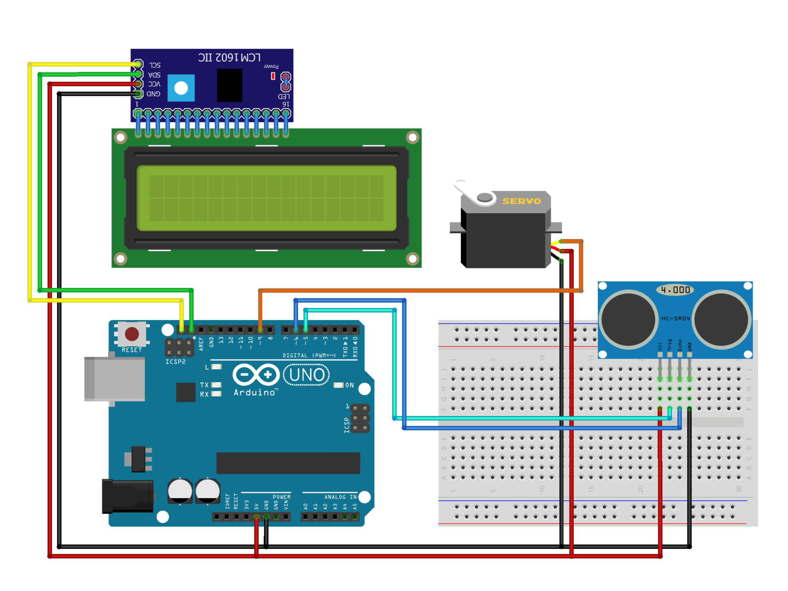

# DAM System Automatic Anti Flood

This project demonstrates an automatic flood prevention system using an Arduino. The system measures water levels using an ultrasonic sensor (HCSR04) and automatically adjusts the position of a dam gate using a servo motor. The water level and dam gate position are displayed on an LCD screen.

## Components Used

- **Arduino IDE** or Text Editor (e.g., Visual Studio Code)
- **Library: LiquidCrystal_I2C**
- **Library: HCSR-04**
- **Library: Servo**
- **Arduino Uno** (or compatible board) - 1 Unit
- **HCSR04 Ultrasonic Sensor** - 1 Unit
- **LiquidCrystal_I2C (LCD)** (16x2) - 1 Unit
- **I2C** - 1 Unit
- **Servo Motor** - 1 Unit
- **Project Board / BreadBoard** - 1 Unit
- **Jumper Wires**
- **Power Supply** (for Arduino and other components)

## Schematic:

- Below you can see a schematic image to facilitate the wiring of cables from the microcontroller to devices, both input and output sensors:



## Circuit Diagram

### Wiring Instructions

- **HCSR04 Ultrasonic Sensor:**
  - **Trig Pin** to Digital Pin 5 (D5) on the Arduino
  - **Echo Pin** to Digital Pin 6 (D6) on the Arduino
  - **VCC** to 5V
  - **GND** to GND
- **Servo Motor:**
  - **Control Pin** to Digital Pin 9 (D9) on the Arduino
  - **VCC** to 5V
  - **GND** to GND
- **LiquidCrystal_I2C (16x2) + Include I2C :**
  - **SDA I2C** to pin A4 on SDA pin the Arduino
  - **SCL I2C** to pin A5 on SCL pin the Arduino
  - **VCC I2C** to 5V
  - **GND I2C** to GND

## Work steps

- Prepare the tools and materials to be used.
- Carry out the wiring process using Figure schematic of the above circuit.
- Open the Arduino IDE software that has been installed on laptop/computer.
- Download all the libraries above and insert the library by opening the Arduino IDE, selecting Sketch > Include Library -> Add.Zip Library.
- Type the program sketch on the Arduino IDE page.
- Enter the I2C LCD address in the sketch program.
- Carry out the program uploading process.

## Code Explanation

The code monitors water levels using the HCSR04 ultrasonic sensor and calculates the height of the water. Based on the water level, it adjusts the dam gate's position using a servo motor, which is displayed as a percentage on an LCD screen.

### Code Breakdown:

- **Sensor Initialization:** The HCSR04 ultrasonic sensor is initialized on pins D5 (Trig) and D6 (Echo).
- **LCD Initialization:** The LiquidCrystal_I2C library is used to interface with a 16x2 LCD display.
- **Servo Control:** The servo motor is controlled on pin D9, adjusting the dam gate between 0° and 90° based on water levels.

```cpp
#include <HCSR04.h>                 // Library for HCSR04 Ultrasonic Sensor
#include <LiquidCrystal_I2C.h>      // Library for LCD I2C
#include <Servo.h>                  // Library for Servo Motor

Servo myservo;
LiquidCrystal_I2C lcd(0x27, 16, 2);   // LCD I2C address
HCSR04 hc(5, 6);                     // Initialize HCSR04 (Trig pin, Echo pin)

float TinggiSensor = 10.21;         // Sensor installation height in cm
float TinggiAir;                    // Water level in cm
int bendungan;                      // Dam gate position in percentage

void setup() {
  lcd.init();            // Initialize LCD
  lcd.setBacklight(HIGH);
  myservo.attach(9);     // Attach servo motor to pin D9
}

void loop() {
  TinggiAir = TinggiSensor - hc.dist();        // Calculate water level
  bendungan = map(TinggiAir, 0, 12, 0, 100);   // Convert to percentage

  if (TinggiAir > 12) {       // Limit maximum water level
    TinggiAir = 12;
    bendungan = 100;
  } else if (TinggiAir < 0) { // Handle errors for negative values
    TinggiAir = 0;
    bendungan = 0;
  }

  lcd.setCursor(0, 0);
  lcd.print("T Air : ");
  lcd.print(TinggiAir);    // Display water level
  lcd.print("cm");

  lcd.setCursor(0, 1);
  lcd.print("Bendungan : ");
  lcd.print(bendungan);    // Display dam gate position
  lcd.print("%");

  bendungan = map(bendungan, 0, 100, 0, 90);  // Convert to angle 0° - 90°
  myservo.write(bendungan);  // Adjust dam gate position

  delay(1000);
  lcd.clear();
}
```

## Installation

1. Gather all components listed above. <br/>
2. Connect the components following the wiring instructions.<br/>
3. Open the Arduino IDE and connect your Arduino board.<br/>
4. Copy the provided code into the Arduino IDE.<br/>
5. Upload the code to your Arduino Uno.<br/>

## Usage

- The system continuously monitors water levels using the ultrasonic sensor.<br/>
- Depending on the water level, the dam gate position is adjusted automatically by the servo motor.<br/>
- The current water level and dam gate position are displayed on the LCD screen.<br/>

## Conclusion

- The DAM System Automatic Anti Flood is an effective solution for managing water levels and preventing floods. This project can be implemented in real-world scenarios where automated flood management is crucial.<br/>

- The opening of the dam gates will be adjusted accordingly automatically according to the water level. The higher the water
  the closer the dam gate becomes. <br/>
